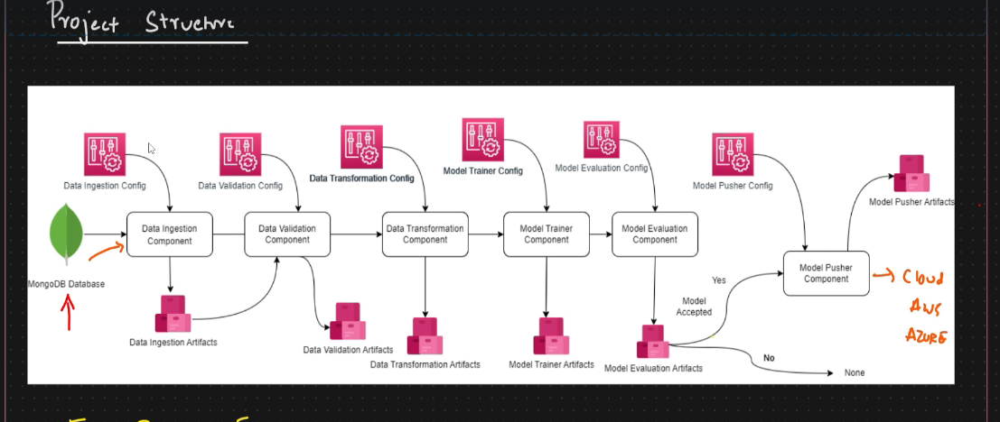
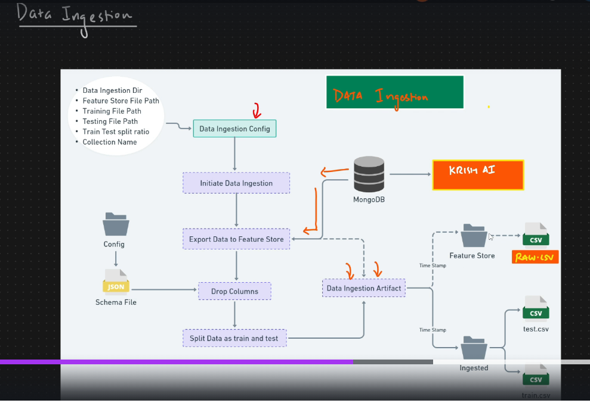
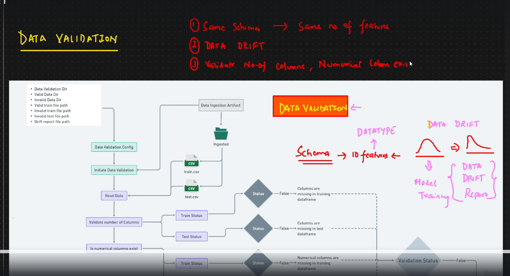

### Network Security Projects For Phising Data

This project is primarly aimed at implementing an end-end MLOps pipeline from data ingestion to model deployment to a AWS EC2 instance covering steps like CI/CD pipelines.

The dataset used is a Phising dataset which has a binary flag indicating whether it is a network security risk or not

